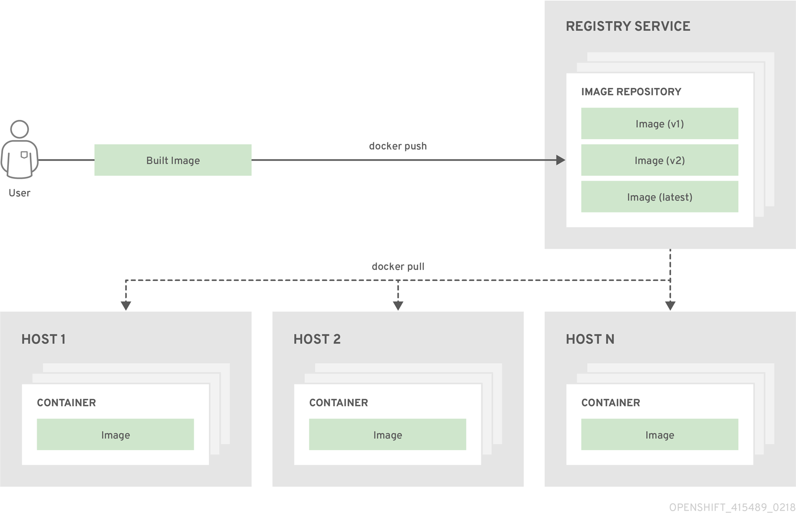

# Containers和Images

## 集装箱
OKD应用程序的基本单元称为容器。 Linux容器技术 是用于隔离正在运行的进程的轻量级机制，因此它们仅限于与其指定资源进行交互。

许多应用程序实例可以在单个主机上的容器中运行，而无法查看彼此的进程，文件，网络等。通常，每个容器提供单个服务（通常称为“微服务”），例如Web服务器或数据库，但容器可用于任意工作负载。

多年来，Linux内核一直在整合容器技术的功能。最近，Docker项目为主机上的Linux容器开发了一个方便的管理界面。OKD和Kubernetes增加了在多主机安装中编排Docker格式容器的能力。

虽然在使用OKD时没有直接与Docker CLI或服务交互，但了解它们的功能和术语对于理解它们在OKD中的作用以及应用程序在容器内的运行方式非常重要。该泊坞窗 RPM可作为RHEL 7，还有的CentOS和Fedora的一部分，所以你可以用它分开OKD实验。有关指导性介绍，请参阅 Red Hat Systems上的Docker格式化容器映像入门一文。

## 初始容器

除应用程序容器外，pod还可以具有init容器。Init容器允许您重新组织设置脚本和绑定代码。init容器与常规容器的不同之处在于它始终运行完成。每个init容器必须在下一个初始容器启动之前成功完成。

## 图片
OKD中的容器基于Docker格式的容器映像。图像是一个二进制文件，包含运行单个容器的所有要求，以及描述其需求和功能的元数据。

您可以将其视为包装技术。容器只能访问映像中定义的资源，除非您在创建容器时为容器提供额外的访问权限。通过在多个主机中的多个容器中部署相同的映像并在它们之间进行负载平衡，OKD可以为打包到映像中的服务提供冗余和水平扩展。

您可以直接使用Docker CLI构建映像，但OKD还提供构建器映像，通过将代码或配置添加到现有映像来帮助创建新映像。

由于应用程序随着时间的推移而发展，因此单个图像名称实际上可以引用“相同”图像的许多不同版本。每个不同的图像通过其散列（例如长十六进制数fd44297e2ddb050ec4f…​）唯一地引用，其通常缩短为12个字符（例如fd44297e2ddb）。

## 图像版本标签策略

而不是版本号，泊坞窗服务允许应用标签（如 v1，v2.1，GA，或默认latest），除了图像名称进一步指定图像需要的话，你可能会看到相同的图像被称为 centos（暗示的latest标记），centos:centos7或者fd44297e2ddb。

> 不要将latest标签用于任何官方的OKD图像。这些是以图像开头的图像openshift3/。latest可以引用许多版本，例如3.10，或3.11。

标记图像的方式决定了更新策略。您越具体，图像更新的频率就越低。使用以下命令确定您选择的OKD图像策略：

VX.Y
vX.Y标记指向XYZ- <number>。例如，如果registry-console 图像更新为v3.11，则它指向最新的3.11.Z- <number>标记，例如3.11.1-8。

XYZ
与上面的vX.Y示例类似，XYZ标记指向最新的XYZ- <number>。例如，3.11.1将指向3.11.1-8

XYZ- <编号>
标签是唯一的，不会改变。使用此标记时，如果更新图像，图像不会更新。例如，3.11.1-8将始终指向3.11.1-8，即使图像已更新。

## 容器图像注册表
容器映像注册表是用于存储和检索Docker格式的容器映像的服务。注册表包含一个或多个图像存储库的集合。每个图像存储库包含一个或多个标记图像。Docker提供自己的注册表Docker Hub，您还可以使用私有或第三方注册表。Red Hat registry.redhat.io为订阅者提供注册表。OKD还可以提供自己的内部注册表来管理自定义容器映像。

容器，映像和注册表之间的关系如下图所示：

