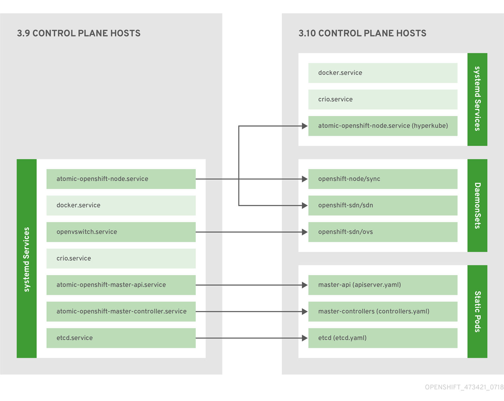

# kubernetes基础设施
[toc]

## 概览
在OKD中，Kubernetes跨一组容器或主机管理容器化应用程序，并提供部署，维护和应用程序扩展的机制。容器运行时包，实例化和运行容器化应用程序。Kubernetes集群由一个或多个主服务器和一组节点组成。

您可以选择将主服务器配置为 高可用性（HA），以确保群集没有单点故障。

## 大师
主服务器是包含控制平面组件的主机，包括API服务器，控制器管理器服务器和etcd。主服务器管理其Kubernetes集群中的节点，并调度 pod以在这些节点上运行。


| 零件 | 描述 |
| --:| :-- |
| API服务器 | Kubernetes API服务器验证和配置容器，服务和复制控制器的数据。它还将pod分配给节点，并将pod信息与服务配置同步。 |
| ETCD | etcd存储持久主状态，而其他组件监视etcd以进行更改以使其自身进入所需状态。etcd可以选择性地配置为高可用性，通常使用2n + 1个对等服务进行部署。|
| Controller Manager Server | 控制器管理器服务器监视etcd以更改复制控制器对象，然后使用API​​强制执行所需的状态。几个这样的过程一次创建一个具有一个活跃领导者的集群。 |
| HAProxy的 | 可选，在使用方法配置 高可用主服务器时使用，native 以平衡API主端点之间的负载。在群集安装过程 可以为您提供配置HAProxy的native方法。或者，您可以使用该native方法，但预先配置您自己选择的负载均衡器。|

## 控制平面静态窗格
核心控制平面组件，API服务器和控制器管理器组件作为 由kubelet操作的静态pod运行。

对于将etcd共同位于同一主机上的主服务器，etcd也会移动到静态pod。在不是主服务器的etcd主机上仍然支持基于RPM的etcd。

此外，节点组件openshift-sdn和 openvswitch现在使用DaemonSet而不是systemd服务运行。




即使控制平面组件作为静态pod运行，主控主机仍然从/etc/origin/master/master-config.yaml 文件中获取其配置，如 主和节点配置主题中所述。

主节点上的kubelet会自动在API服务器上为每个控制平面静态pod 创建镜像窗格，以便它们在kube-system项目的集群中可见。这些静态pod的清单默认由openshift-ansible安装程序安装，该安装程序位于 主控主机上的/ etc / origin / node / pods目录中。

这些pod具有以下hostPath定义的卷：
- /etc/origin/master Contains all certificates, configuration files, and the admin.kubeconfig file.
- /var/lib/origin Contains volumes and potential core dumps of the binary.
- /etc/origin/cloudprovider Contains cloud provider specific configuration (AWS, Azure, etc.).
- /usr/libexec/kubernetes/kubelet-plugins Contains additional third party volume plug-ins.
- /etc/origin/kubelet-plugins Contains additional third party volume plug-ins for system containers.


## 重启master服务

重启master api
```bash
master-restart api
```
重启controllers
```bash
master-restart controllers
```

重启etcd
```bash
master-restart etcd
```

## 查看master服务日志
```bash
master-logs api api
master-logs controllers controllers
master-logs etcd etcd

```

## master节点高可用
您可以选择将主服务器配置为高可用性（HA），以确保群集没有单点故障。

为了减轻对主服务器可用性的担忧，建议进行两项活动：

一个运行手册条目应该用于重建主创建。Runbook条目是任何高可用性服务的必要支持。其他解决方案仅控制必须查阅Runbook的频率。例如，主主机的冷备用可以充分满足需要不超过几分钟的停机时间来创建新应用程序或恢复失败的应用程序组件的SLA。

使用高可用性解决方案来配置主服务器并确保群集没有单点故障。所述 簇安装文档提供了使用的特定示例nativeHA方法和配置HAProxy的。您还可以使用该native方法而不是HAProxy 将这些概念应用于现有的HA解决方案。

> 在生产OKD群集中，您必须保持API Server负载均衡器的高可用性。如果API服务器负载均衡器不可用，则节点无法报告其状态，所有其pod都标记为已死，并且已从服务中删除pod的端点。

> 除了为OKD配置HA之外，还必须为API Server负载均衡器单独配置HA。要配置HA，最好集成企业负载均衡器（LB），例如F5 Big-IP™或Citrix Netscaler™设备。如果此类解决方案不可用，则可以运行多个HAProxy负载平衡器并使用Keepalived为HA提供浮动虚拟IP地址。但是，建议不要将此解决方案用于生产实例。

将nativeHA方法与HAProxy一起使用时，主组件具有以下可用性：
| 角色 | 样式 | 备注 |
|---|----|---|
|ETCD | 主动-主动 | 具有负载平衡的完全冗余部署。可以安装在单独的主机上，也可以并置在主主机上
| API服务器 | 主动-主动 | 由HAProxy管理。|
| Controller Manager Server| 主动-被动| 一次选出一个实例作为集群领导者。|
| HAProxy的 | 主动-被动| 平衡API主端点之间的负载。|

虽然群集etcd需要奇数个主机用于仲裁，但主服务没有法定数量或要求它们具有奇数个主机。但是，由于HA需要至少两个主服务，因此在并置主服务和etcd时，通常会保持统一的奇数个主机。


## 节点

节点为容器提供运行时环境。Kubernetes集群中的每个节点都具有由主服务器管理的所需服务。节点还具有运行pod所需的服务，包括容器运行时，kubelet和服务代理。

OKD从云提供商，物理系统或虚拟系统创建节点。Kubernetes与节点对象交互，节点对象 是这些节点的表示。主服务器使用来自节点对象的信息来验证具有运行状况检查的节点。在通过运行状况检查之前，将忽略节点，并且主节点继续检查节点，直到它们有效。该Kubernetes文档 对节点状态和管理的更多信息。

管理员可以使用CLI 管理 OKD实例中的节点。要在启动节点服务器时定义完整配置和安全选项，请使用 专用节点配置文件。


### kubelet
每个节点都有一个kubelet，用于更新容器清单指定的节点，容器清单是描述容器的YAML文件。kubelet使用一组清单来确保其容器已启动并继续运行。

可以通过以下方式将容器清单提供给kubelet：
- 命令行上的文件路径，每20秒检查一次
- 在命令行上传递的http端点，每20秒检查一次。
- 观察etcd服务器的kubelet，并对任何更改进行操作
- kubelet监听http并响应简单的api以提交新的清单

### 服务代理
每个节点还运行一个简单的网络代理，该代理反映该节点上API中定义的服务。这允许节点跨一组后端执行简单的TCP和UDP流转发。

### 节点对象定义
```yaml
apiVersion: v1 
kind: Node 
metadata:
  creationTimestamp: null
  labels: 
    kubernetes.io/hostname: node1.example.com
  name: node1.example.com 
spec:
  externalID: node1.example.com 
status:
  nodeInfo:
    bootID: ""
    containerRuntimeVersion: ""
    kernelVersion: ""
    kubeProxyVersion: ""
    kubeletVersion: ""
    machineID: ""
    osImage: ""
    systemUUID: ""
```


